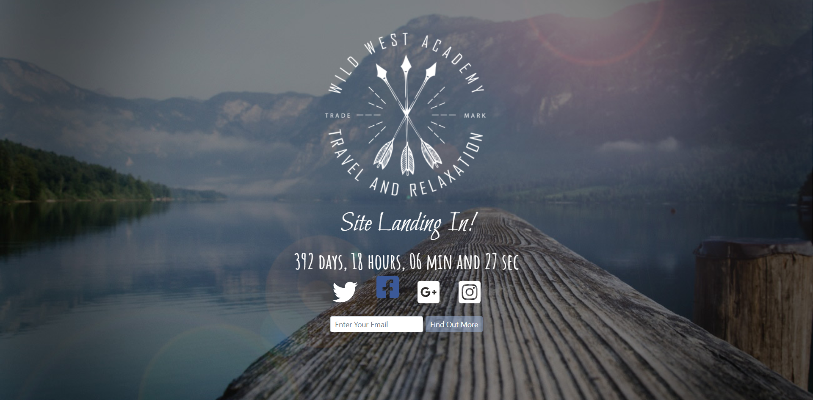

<!DOCTYPE html>
<html>
    <body>
        <h1>Coming Soon!</h1>
        

        Live Working <a href="https://bstraplandingpage.firebaseapp.com/">Here!</a>
        
        
This landing page is created using bootstrap and works as a coming soon page with countdown timer. Has different Social media icons!
 
        
It also has a input field for recieving email id's of visitors. You can recieve the information through Google Forms or use
            PHP.
        

        <h4>Adjusting the Countdown</h4>
        

        
In index.html file there is a following piece of javascript code:  
<pre><code>
    $(function() {
    $('.countdown').countdown({
    date: "June 30 , 2021 15:03:26"
        });
    });
</code></pre> 
            Change the date as per your requirement,make sure the date is in similar format (<code>Month date, Year Time(24 hr format)</code>)
        

    </body>
</html>
